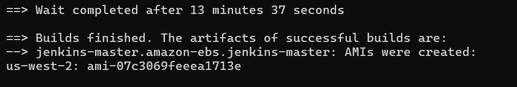
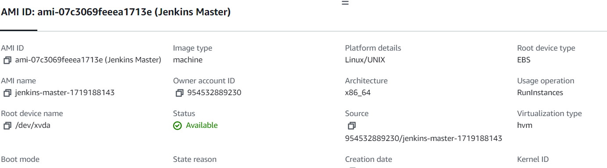
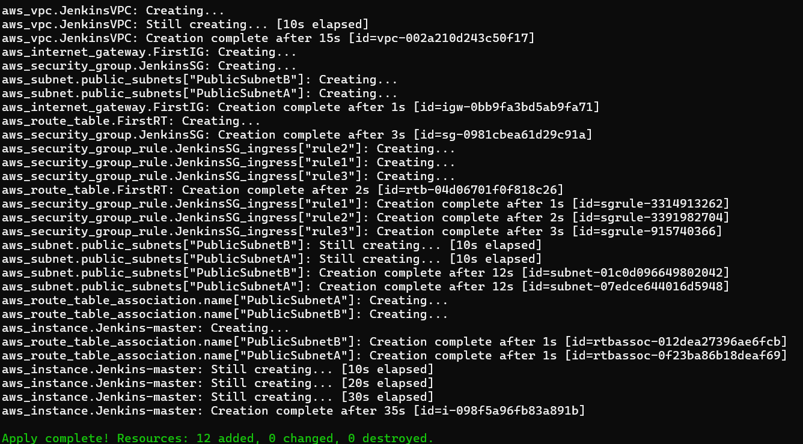
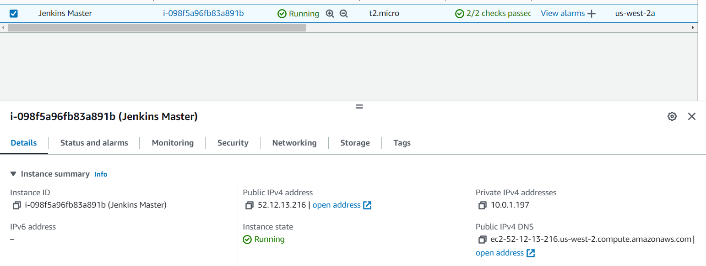
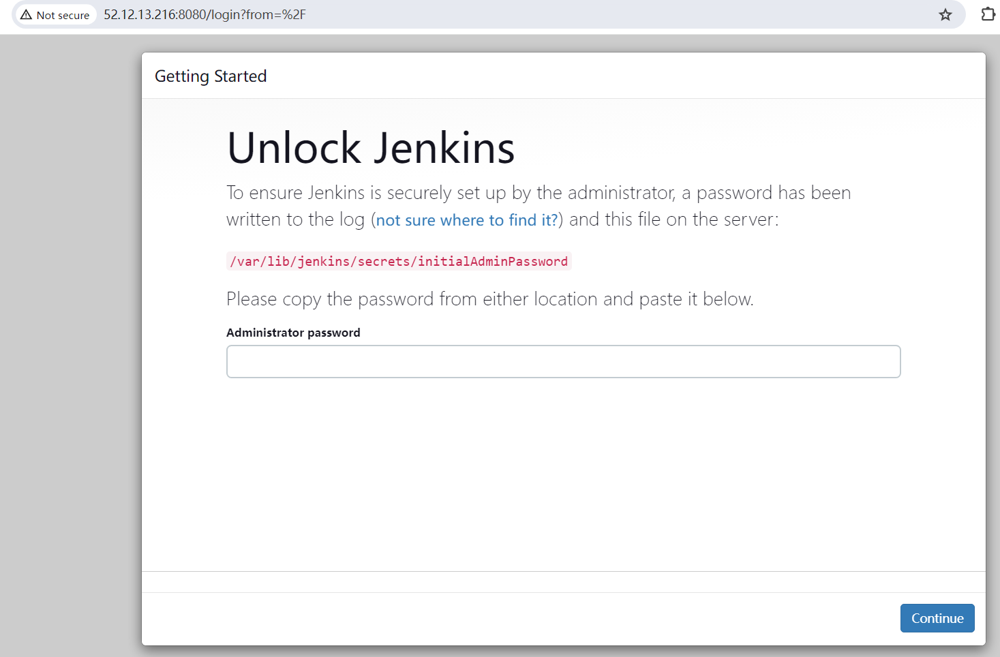

# packer-ansible-jenkins-terrafrom-aws
Packer and Ansible to create AWS ami with Jenkins installed. Terraform to deploy Jenkins into AWS EC2

## Pre-requistes
- Terraform, Packer and Ansible are installed
- aws credentials/config are stored in `` ~./.aws/credentials `` and `` ~./.aws/config ``

## Build AWS AMI with Jenkins installed using Packer and Ansible
```
packer build -var-file="variables.pkrvars.hcl" aws-jenkins.pkr.hcl
```


## Deploy Jenkins in AWS EC2 using Terraform

```
cd terraform
terraform apply
```


Connect to <span style="color: blue;"><u>http://<your_server_public_DNS>:8080</u></span> from your browser. 
Reference: [Jenkins on AWS](https://www.jenkins.io/doc/tutorials/tutorial-for-installing-jenkins-on-AWS/)





